# Artly - Artwork Management System

<p align="center">
  
</p>

<p align="center">
  <a href="https://play.google.com/store/apps/details?id=com.orion.templete">
    
  </a>
  &nbsp;
  <a href="https://artwrk.studio/">
    
  </a>
</p>

## Project Overview

Artly is a comprehensive artwork management system built with Spring Boot, MongoDB, and Neo4j. The application provides a platform for artists to showcase their artwork, users to browse, like, and comment on artwork, and includes features for artwork recommendations, user authentication, and more.

## Setup Instructions

### Prerequisites
- Java 17 or higher
- Maven
- MongoDB
- Neo4j
- Python 3.x (for artwork importer)

### Local Setup

1. **Clone the repository**
   ```bash
   git clone <repository-url>
   cd JWTSecurity
   ```

2. **Configure the application**
   
   Update the `application.yml` file with your MongoDB and Neo4j credentials:
   ```yaml
   spring:
     data:
       mongodb:
         authentication-database: admin
         database: artly
         uri: your-mongodb-uri
       neo4j:
         uri: your-neo4j-uri
         authentication:
           username: your-username
           password: your-password
   ```

3. **Build the application**
   ```bash
   ./mvnw clean install
   ```

4. **Run the application**
   ```bash
   ./mvnw spring-boot:run
   ```

5. **Install Python dependencies** (for artwork importer)
   ```bash
   pip install -r requirements.txt
   ```

6. **Run the artwork importer**
   ```bash
   python artwork_importer_improved.py --delay 0 --batch-size 20
   ```

### Docker Setup

1. **Build the Docker image**
   ```bash
   docker build -t artly-app .
   ```

2. **Run the Docker container**
   ```bash
   docker run -p 7040:7040 artly-app
   ```

### Accessing the Application

- **API Endpoint**: http://localhost:7040
- **Swagger UI**: http://localhost:7040/swagger-ui/index.html
- **Production Swagger UI**: https://hammerhead-app-zgpcv.ondigitalocean.app/swagger-ui/index.html

## System Architecture

```mermaid
---
title: Artly System Architecture Overview
---
graph TB
    %% User Layer
    subgraph "Client Layer"
        Web[🌐 Web Interface]
        Mobile[📱 Mobile App]
        API_Client[🔧 API Client]
    end
    
    %% API Gateway
    subgraph "API Gateway"
        Gateway[🚪 Spring Boot Gateway<br/>Port: 7040]
        Swagger[📚 Swagger UI<br/>Documentation]
    end
    
    %% Authentication Layer
    subgraph "Authentication Services"
        JWT[🔐 JWT Security]
        Auth_Service[👤 Auth Service]
        Profile_Service[👥 Profile Service]
    end
    
    %% Core Services
    subgraph "Core Services"
        Artwork_Service[🎨 Artwork Service]
        Artist_Service[👨‍🎨 Artist Service]
        Comment_Service[💬 Comment Service]
        Gallery_Service[🖼️ Gallery Service]
        Shopping_Service[🛒 Shopping Service]
    end
    
    %% Data Layer
    subgraph "Data Layer"
        MongoDB[(🍃 MongoDB<br/>User Profiles<br/>Shopping Data)]
        Neo4j[(🔗 Neo4j<br/>Artwork Graph<br/>Relationships)]
        Firebase[☁️ Firebase<br/>Media Storage]
    end
    
    %% External Services
    subgraph "External Services"
        Python_Importer[🐍 Python Artwork Importer]
    end
    
    %% Connections
    Web --> Gateway
    Mobile --> Gateway
    API_Client --> Gateway
    
    Gateway --> JWT
    Gateway --> Swagger
    
    JWT --> Auth_Service
    Auth_Service --> Profile_Service
    
    Gateway --> Artwork_Service
    Gateway --> Artist_Service
    Gateway --> Comment_Service
    Gateway --> Gallery_Service
    Gateway --> Shopping_Service
    
    Profile_Service --> MongoDB
    Shopping_Service --> MongoDB
    
    Artwork_Service --> Neo4j
    Artist_Service --> Neo4j
    Comment_Service --> Neo4j
    Gallery_Service --> Neo4j
    
    Artwork_Service --> Firebase
    
    Python_Importer --> Neo4j
    Python_Importer --> Firebase
    
    %% Styling
    classDef clientStyle fill:#e1f5fe,stroke:#01579b,stroke-width:2px,color:#000
    classDef apiStyle fill:#f3e5f5,stroke:#4a148c,stroke-width:2px,color:#000
    classDef authStyle fill:#fff3e0,stroke:#e65100,stroke-width:2px,color:#000
    classDef serviceStyle fill:#e8f5e8,stroke:#2e7d32,stroke-width:2px,color:#000
    classDef dataStyle fill:#ffebee,stroke:#c62828,stroke-width:2px,color:#000
    classDef externalStyle fill:#fce4ec,stroke:#880e4f,stroke-width:2px,color:#000
    
    class Web,Mobile,API_Client clientStyle
    class Gateway,Swagger apiStyle
    class JWT,Auth_Service,Profile_Service authStyle
    class Artwork_Service,Artist_Service,Comment_Service,Gallery_Service,Shopping_Service serviceStyle
    class MongoDB,Neo4j,Firebase dataStyle
    class Python_Importer externalStyle
```



## Authentication Flow

```mermaid
sequenceDiagram
    participant U as 🧑‍💻 User
    participant W as 🌐 Web Client
    participant G as 🚪 API Gateway
    participant A as 🔐 Auth Service
    participant P as 👥 Profile Service
    participant J as 🎫 JWT Utils
    participant M as 🍃 MongoDB
    
    Note over U,M: 🔐 User Authentication Flow
    
    U->>W: Enter credentials
    W->>G: POST /login
    G->>A: Authenticate user
    A->>P: Validate credentials
    P->>M: Query user profile
    M->>P: Return profile data
    P->>A: Authentication result
    
    alt Authentication Success
        A->>J: Generate JWT token
        J->>A: Return signed token
        A->>G: Authentication success + token
        G->>W: JWT Response
        W->>U: Login successful
        
        Note over U,M: 🔒 Subsequent Protected API Calls
        U->>W: Request protected resource
        W->>G: API call with Bearer token
        G->>J: Validate JWT token
        J->>G: Token validation result
        
        alt Token Valid
            G->>A: Process request
            A->>G: Return response
            G->>W: API response
            W->>U: Display data
        else Token Invalid/Expired
            G->>W: 401 Unauthorized
            W->>U: Redirect to login
        end
        
    else Authentication Failed
        A->>G: Authentication failed
        G->>W: 401 Unauthorized
        W->>U: Invalid credentials
    end
```



## Data Model Relationships

```mermaid
---
title: Neo4j Graph Database Relationships
---
graph LR
    %% Users and Authentication
    User[👤 User<br/>MongoDB Profile]
    Neo4jUser[👤 Neo4j User<br/>Social Data]
    
    %% Core Entities
    Artwork[🎨 Artwork<br/>Title, Artist<br/>Medium, Style]
    Artist[👨‍🎨 Artist<br/>Biography<br/>Movement]
    Gallery[🖼️ Gallery<br/>Curated Collection]
    Comment[💬 Comment<br/>User Feedback]
    
    %% Collections
    Favorites[⭐ Favorites<br/>Personal Collection]
    Genre[🎭 Genre<br/>Art Category]
    Year[📅 Year<br/>Release Date]
    
    %% Shopping (MongoDB)
    CartItem[🛒 Cart Item]
    OrderItem[📦 Order Item]
    Address[🏠 Address]
    
    %% Relationships
    User -.->|Profile Sync| Neo4jUser
    User -->|HAS| CartItem
    User -->|HAS| OrderItem
    User -->|HAS| Address
    
    Neo4jUser -->|LIKES| Artwork
    Neo4jUser -->|FOLLOWS| Artist
    Neo4jUser -->|POSTED_COMMENT| Comment
    Neo4jUser -->|CREATED| Favorites
    Neo4jUser -->|LIKES| Gallery
    Neo4jUser -->|LIKES| Genre
    
    Artist -->|CREATED| Artwork
    Artist -->|BELONGS_TO_GENRE| Genre
    Artist -->|CREATED| Gallery
    
    Artwork -->|HAS_COMMENT| Comment
    Artwork -->|BELONGS_TO| Gallery
    Artwork -->|RELEASED_IN| Year
    Artwork -->|BELONGS_TO_GENRE| Genre
    
    Favorites -->|CONTAINS| Artwork
    
    %% Styling
    classDef userStyle fill:#e3f2fd,stroke:#1976d2,stroke-width:3px
    classDef contentStyle fill:#f3e5f5,stroke:#7b1fa2,stroke-width:2px
    classDef socialStyle fill:#e8f5e8,stroke:#388e3c,stroke-width:2px
    classDef shoppingStyle fill:#fff3e0,stroke:#f57c00,stroke-width:2px
    classDef metaStyle fill:#fce4ec,stroke:#c2185b,stroke-width:2px
    
    class User,Neo4jUser userStyle
    class Artwork,Artist,Gallery contentStyle
    class Comment,Favorites socialStyle
    class CartItem,OrderItem,Address shoppingStyle
    class Genre,Year metaStyle
```



## API Workflow

```mermaid
---
title: Artwork Browsing & Interaction Flow
---
sequenceDiagram
    participant U as 🧑‍💻 User
    participant W as 🌐 Web Client
    participant G as 🚪 API Gateway
    participant AS as 🎨 Artwork Service
    participant CS as 💬 Comment Service
    participant N as 🔗 Neo4j Database
    participant F as ☁️ Firebase Storage
    
    Note over U,F: 🎨 Artwork Discovery Flow
    
    U->>+W: Browse artworks
    W->>+G: GET /artwork/recommend?userId=123
    G->>+AS: Get recommended artworks
    AS->>+N: Query personalized recommendations
    N-->>-AS: Return artwork data
    AS->>+F: Get image URLs
    F-->>-AS: Return media URLs
    AS-->>-G: Artwork list with metadata
    G-->>-W: JSON response
    W-->>-U: Display artwork gallery
    
    Note over U,F: 👍 User Interaction Flow
    
    U->>+W: Like artwork
    W->>+G: PUT /artwork/user/like/{artworkId}/{userId}
    G->>+AS: Process like action
    AS->>+N: Create LIKES relationship
    N-->>-AS: Confirm relationship created
    AS-->>-G: Success response
    G-->>-W: Like confirmed
    W-->>-U: Update UI (heart filled)
    
    Note over U,F: 💬 Comment Flow
    
    U->>+W: Add comment
    W->>+G: POST /comment/add
    G->>+CS: Create comment
    CS->>+N: Store comment + relationships
    N-->>-CS: Comment saved
    CS-->>-G: Comment created
    G-->>-W: Comment response
    W-->>-U: Display new comment
    
    Note over U,F: 🔍 Artist Discovery
    
    U->>+W: View artist profile
    W->>+G: GET /artist/{artistId}
    G->>+AS: Get artist details
    AS->>+N: Query artist + artworks
    N-->>-AS: Artist data + portfolio
    AS-->>-G: Complete artist profile
    G-->>-W: Artist information
    W-->>-U: Show artist page
```



## App Structure

```
JWTSecurity/
├── src/
│   ├── main/
│   │   ├── java/
│   │   │   └── com/
│   │   │       └── basic/
│   │   │           └── JWTSecurity/
│   │   │               ├── artwork_server/
│   │   │               │   ├── api/
│   │   │               │   ├── config/
│   │   │               │   ├── dto/
│   │   │               │   ├── model/
│   │   │               │   ├── repository/
│   │   │               │   └── service/
│   │   │               ├── auth/
│   │   │               │   ├── api/
│   │   │               │   ├── config/
│   │   │               │   ├── model/
│   │   │               │   ├── repository/
│   │   │               │   ├── security/
│   │   │               │   └── service/
│   │   │               ├── shopping_server/
│   │   │               │   ├── collection/
│   │   │               │   ├── controller/
│   │   │               │   ├── repository/
│   │   │               │   └── service/
│   │   │               └── JwtSecurityApplication.java
│   │   └── resources/
│   │       └── application.yml
│   └── test/
├── artwork_importer_improved.py
├── Dockerfile
├── pom.xml
└── README.md
```

## Database Schema

### MongoDB Collections

#### Profile Collection
```json
{
  "id": "String",
  "username": "String",
  "password": "String",
  "phoneNumber": "String",
  "roles": ["String"]
}
```

### Neo4j Nodes and Relationships

#### Artwork Node
```
Artwork {
  id: String
  title: String
  status: Status
  artist: String
  storageType: StorageType
  releasedDate: LocalDateTime
  type: ArtType
  medium: String
  description: String
  dimensions: String
  current_location: String
  period_style: String
  art_movement: String
  image_url_compressed: String
  image_url: String
  license_info: String
  source_url: String
}
```

#### Profile
The Profile model represents user accounts in the system and is stored in MongoDB.

```java
@Document(collection = "user")
public class Profile {
    @Id
    private String id;              // Unique identifier for the user
    private String username;        // Username for login
    private String phone;           // User's phone number
    private String password;        // Encrypted password
    private List<Address> userAddress;  // User's shipping addresses
    private List<CartItem> cardItems;   // Items in user's shopping cart
    private List<OrderItem> orderItems; // User's order history
}
```

**Purpose**: Manages user authentication, shopping cart, and order history.

#### Address
Represents a shipping address for orders.

```java
@Document(collection = "address")
public class Address {
    @Id
    private String id;              // Unique identifier
    private String name;            // Recipient name
    private String streetAddress;   // Street address
    private String apartment;       // Apartment/suite number
    private String city;            // City
    private String state;           // State/province
    private String zipCode;         // Postal code
    private String phone;           // Contact phone number
    private Boolean isDefault;      // Whether this is the default address
}
```

**Purpose**: Stores shipping information for order fulfillment.

#### CartItem
Represents an item in a user's shopping cart.

```java
@Document(collection = "CartItem")
public class CartItem {
    @Id
    private String id;              // Unique identifier
    private String title;           // Artwork title
    private String artist;          // Artist name
    private Double price;           // Item price
    private String imageUrl;        // Artwork image URL
    private Integer quantity;       // Quantity in cart
}
```

**Purpose**: Tracks items that users have added to their shopping cart.

#### OrderItem
Represents an item in a completed order.

```java
@Document(collection = "OrderItem")
public class OrderItem {
    private String id;              // Unique identifier
    private String title;           // Artwork title
    private String artist;          // Artist name
    private Double price;           // Item price
    private Integer quantity;       // Quantity ordered
    private String imageUrl;        // Artwork image URL
}
```

**Purpose**: Records purchased items in completed orders.

#### OrderSummary
Represents a complete order with all details.

```java
@Document(collection = "OrderSummary")
public class OrderSummary {
    private List<OrderItem> items;          // Items in the order
    private Double subtotal;                // Order subtotal
    private Double shipping;                // Shipping cost
    private Double tax;                     // Tax amount
    private Double total;                   // Total order cost
    private Address shippingAddress;        // Shipping address
    private PaymentMethod paymentMethod;    // Payment method used
}
```

**Purpose**: Provides a complete summary of an order for processing and record-keeping.

#### PaymentMethod
Represents a payment method used for orders.

```java
@Document(collection = "PaymentMethod")
public class PaymentMethod {
    private String type;            // Payment type (credit card, PayPal, etc.)
    private String lastFourDigits;  // Last four digits of card
    private String expiryDate;      // Card expiry date
}
```

**Purpose**: Stores payment information for processing orders.

### Neo4j Models

#### Artwork
The central entity in the artwork graph database.

```java
@Node("Artwork")
public class Artwork {
    @Id
    @GeneratedValue(generatorClass = UUIDStringGenerator.class)
    private String id;                  // Unique identifier
    private String title;               // Artwork title
    private Status status;              // Publication status (DRAFT, PUBLISHED, etc.)
    private String artist;              // Artist name
    private StorageType storageType;    // Storage type (Firebase)
    private LocalDateTime releasedDate; // Release date
    private ArtType type;               // Type (IMAGE, VIDEO, etc.)
    private String medium;              // Medium used (oil, acrylic, etc.)
    private String description;         // Artwork description
    private String dimensions;          // Physical dimensions
    private String current_location;    // Current location of the artwork
    private String period_style;        // Art period or style
    private String art_movement;        // Art movement
    private String image_url_compressed;// Compressed image URL
    private String image_url;           // Full-resolution image URL
    private String license_info;        // Licensing information
    private String source_url;          // Source URL

    // Relationships
    @Relationship(value = "HAS_COMMENT", direction = Relationship.Direction.INCOMING)
    private List<Comment> comments;     // Comments on the artwork
    
    @Relationship(value = "FEATURED_WITH", direction = Relationship.Direction.INCOMING)
    private List<Artist> featuredArtist;// Featured artists
    
    @Relationship(value = "RELEASED_IN")
    private Year year;                  // Release year
    
    @Relationship(value = "BELONGS", direction = Relationship.Direction.INCOMING)
    private Gallery gallery;            // Gallery containing the artwork
}
```

**Purpose**: Central entity representing artworks with detailed metadata and relationships to artists, comments, galleries, etc.

#### Artist
Represents an artist who creates artwork.

```java
@Node("Artist")
public class Artist {
    @Id
    private String id;              // Unique identifier
    private String name;            // Artist name
    private String birth_date;      // Birth date
    private String death_date;      // Death date (if applicable)
    private String nationality;     // Nationality
    private String notable_works;   // Notable works
    private String art_movement;    // Art movement
    private String education;       // Educational background
    private String awards;          // Awards received
    private String image_url;       // Artist image URL
    private String wikipedia_url;   // Wikipedia URL
    private String description;     // Artist biography

    // Relationships
    @Relationship(value = "BELONGS_TO_GENRE")
    private Genre genre;            // Primary genre
    
    @Relationship("CREATED")
    private List<ArtistRelationship> artworks;  // Created artworks
    
    @Relationship("CREATED")
    private List<GalleryRelationship> galleries; // Created galleries
}
```

**Purpose**: Represents artists with biographical information and relationships to their artworks and galleries.

#### User
Represents a user in the Neo4j database (connected to MongoDB Profile).

```java
@Node("User")
public class User {
    @Id
    private String id;              // Unique identifier (matches MongoDB Profile ID)
    private String name;            // User's display name
    private String profilePicture;  // Profile picture URL
    private LocalDate dob;          // Date of birth
    private String gender;          // Gender
    private String language;        // Preferred language
    private String countryIso2;     // Country code

    // Relationships
    @Relationship("IS_AN")
    private Artist artist;          // If user is also an artist
    
    @Relationship("LIKES")
    private List<Genre> likedGenres;// Genres the user likes
    
    @Relationship("CREATED")
    private List<Favorites> favorites; // User's favorite collections
    
    @Relationship("LIKES")
    private List<Gallery> galleries;// Galleries the user likes
    
    @Relationship("POSTED_COMMENT")
    private List<Comment> comments; // Comments posted by user
    
    @Relationship("FOLLOWS")
    private List<FollowRelationship> artists; // Artists the user follows
}
```

**Purpose**: Represents users in the graph database, enabling social features like following artists, liking artworks, and creating favorites collections.

#### Comment
Represents a comment on an artwork.

```java
@Node("Comment")
public class Comment {
    @Id
    @GeneratedValue(generatorClass = UUIDStringGenerator.class)
    private String id;              // Unique identifier
    private String text;            // Comment text
    private LocalDateTime createdAt;// Creation timestamp
    private LocalDateTime updatedAt;// Last update timestamp
    private Boolean edited;         // Whether the comment has been edited

    // Relationships
    @Relationship(type = "POSTED_COMMENT", direction = Relationship.Direction.INCOMING)
    private User user;              // User who posted the comment
    
    @Relationship(type = "HAS_COMMENT")
    private Artwork artwork;        // Artwork being commented on
}
```

**Purpose**: Enables user interaction through comments on artworks.

#### Gallery
Represents a curated collection of artworks.

```java
@Node("Gallery")
public class Gallery {
    @Id
    @GeneratedValue(generatorClass = UUIDStringGenerator.class)
    private String id;              // Unique identifier
    private String description;     // Gallery description
    private String name;            // Gallery name
    private String coverUrl;        // Cover image URL
    private Status status;          // Publication status

    // Relationships
    @Relationship(type = "IS_IN", direction = Relationship.Direction.INCOMING)
    private Set<Artwork> artwork;   // Artworks in the gallery
}
```

**Purpose**: Allows for curated collections of artworks to be displayed together.

#### Favorites
Represents a user's collection of favorite artworks.

```java
@Node("Favorites")
public class Favorites {
    @Id
    @GeneratedValue(generatorClass = UUIDStringGenerator.class)
    private String id;              // Unique identifier
    private String title;           // Collection title
    private String description;     // Collection description

    // Relationships
    @Relationship("CREATED")
    private User user;              // User who created the collection
    
    @Relationship("CONTAINS")
    private List<Artwork> artworks; // Artworks in the collection
}
```

**Purpose**: Allows users to create personal collections of favorite artworks.

#### Genre
Represents an art genre or category.

```java
@Node("Genre")
public class Genre {
    @Id
    @GeneratedValue(generatorClass = UUIDStringGenerator.class)
    private String id;              // Unique identifier
    private String key;             // Genre key/code
    private String name;            // Genre name

    // Relationships
    @Relationship("BELONGS_TO_GENRE")
    private List<Artwork> artworks; // Artworks in this genre
    
    @Relationship("BELONGS_TO_GENRE")
    private List<Artist> artists;   // Artists working in this genre
}
```

**Purpose**: Categorizes artworks and artists by genre, enabling genre-based browsing and recommendations.

#### Year
Represents a year for artwork dating.

```java
@Node("Year")
public class Year {
    @Id
    private String id;              // Unique identifier
    private Integer year;           // Year value
}
```

**Purpose**: Enables temporal organization and searching of artworks.

### Enumerations

#### ArtType
Defines the types of artwork supported.

```java
public enum ArtType {
    IMAGE,              // Static images
    VIDEO,              // Video content
    PODCAST_IMAGE,      // Podcast with image
    PODCAST_VIDEO       // Video podcast
}
```

#### Status
Defines the publication status of content.

```java
public enum Status {
    DRAFT,              // Not yet published
    PUBLISHED,          // Publicly available
    BLOCKED,            // Blocked by moderators
    APPROVED,           // Approved but not published
    DELETED             // Marked as deleted
}
```

#### StorageType
Defines where artwork media is stored.

```java
public enum StorageType {
    Firebase            // Stored in Firebase storage
}
```

## Relationship Models

### ArtistRelationship
Represents the relationship between an artist and their artwork.

### FollowRelationship
Represents a user following an artist.

### GalleryRelationship
Represents the relationship between an artist and a gallery they've created.

## Authentication Models

### JwtRequest
Used for login requests.

```java
public class JwtRequest {
    private String username;    // Username for login
    private String password;    // Password for login
}
```

### JwtResponse
Returned after successful authentication.

```java
public class JwtResponse {
    private String token;       // JWT token
    private String username;    // Authenticated username
    private List<String> roles; // User roles
}
```

### TokenRequest
Used for token validation.

```java
public class TokenRequest {
    private String token;       // JWT token to validate
}
```

### ForgetPasswordRequest
Used for password reset requests.

```java
public class ForgetPasswordRequest {
    private String phoneNumber; // User's phone number
    private String newPassword; // New password
}
```

## Model Relationships

The Artly system uses a rich graph database structure in Neo4j to model complex relationships:

1. **User-Artwork Interactions**:
    - Users can LIKE artworks
    - Users can DISLIKE artworks
    - Users can POST_COMMENT on artworks
    - Users can add artworks to FAVORITES collections

2. **Artist Relationships**:
    - Artists CREATED artworks
    - Users can FOLLOW artists
    - Artists BELONG_TO_GENRE genres

3. **Artwork Organization**:
    - Artworks BELONG to galleries
    - Artworks RELEASED_IN specific years
    - Artworks BELONG_TO_GENRE genres

4. **Social Features**:
    - Comments are linked to both users (POSTED_COMMENT) and artworks (HAS_COMMENT)
    - Users can create and manage multiple FAVORITES collections

## API Contract

### Authentication APIs

#### Login
- **Endpoint**: `/login`
- **Method**: POST
- **Request Body**:
  ```json
  {
    "username": "string",
    "password": "string"
  }
  ```**
- **Response**:
  ```json
  {
    "token": "string",
    "username": "string",
    "roles": ["string"]
  }
  ```

#### Signup
- **Endpoint**: `/signup`
- **Method**: POST
- **Request Body**:
  ```json
  {
    "username": "string",
    "password": "string",
    "phoneNumber": "string",
    "roles": ["string"]
  }
  ```
- **Response**: Same as login

### Artwork APIs

#### Get Recommended Artwork
- **Endpoint**: `/artwork/recommend`
- **Method**: GET
- **Parameters**:
  - `userId`: string
  - `skip`: integer
  - `limit`: integer
- **Response**: List of artwork objects

#### Get Popular Artwork
- **Endpoint**: `/artwork/popular`
- **Method**: GET
- **Parameters**:
  - `userId`: string
  - `skip`: integer
  - `limit`: integer
- **Response**: List of artwork objects

#### Get New Arrivals
- **Endpoint**: `/artwork/new-arrivals`
- **Method**: GET
- **Parameters**:
  - `userId`: string
  - `skip`: integer
  - `limit`: integer
- **Response**: List of artwork objects

#### Get Artwork by ID
- **Endpoint**: `/artwork/{userId}/{artworkId}`
- **Method**: GET
- **Response**: Artwork object

#### Like Artwork
- **Endpoint**: `/artwork/user/like/{artworkId}/{userId}`
- **Method**: PUT

#### Unlike Artwork
- **Endpoint**: `/artwork/user/unlike/{artworkId}/{userId}`
- **Method**: PUT

#### Dislike Artwork
- **Endpoint**: `/artwork/user/dislike/{artworkId}/{userId}`
- **Method**: PUT

### Artist APIs

#### Get Artist by ID
- **Endpoint**: `/artist/{artistId}`
- **Method**: GET
- **Response**: Artist object

#### Get All Artists
- **Endpoint**: `/artist/all`
- **Method**: GET
- **Response**: List of artist objects

### Comment APIs

#### Add Comment
- **Endpoint**: `/comment/add`
- **Method**: POST
- **Request Body**:
  ```json
  {
    "userId": "string",
    "artworkId": "string",
    "text": "string"
  }
  ```

#### Get Comments for Artwork
- **Endpoint**: `/comment/{artworkId}`
- **Method**: GET
- **Response**: List of comment objects

## Swagger Documentation

The API documentation is available through Swagger UI:

- **Local**: http://localhost:7040/swagger-ui/index.html
- **Production**: https://hammerhead-app-zgpcv.ondigitalocean.app/swagger-ui/index.html

The Swagger UI provides a comprehensive interface to explore and test all available APIs. It includes detailed information about request parameters, response formats, and authentication requirements.

## Security

The application uses JWT (JSON Web Token) for authentication. All API endpoints (except login, signup, and public endpoints) require a valid JWT token in the Authorization header:

```
Authorization: Bearer <your-jwt-token>
```

## Shopping & E-commerce Flow

```mermaid
---
title: Shopping Cart & Order Processing
---
graph TD
    %% User Actions
    U[👤 User] -->|Browse| A[🎨 Artwork Gallery]
    A -->|Add to Cart| C[🛒 Shopping Cart]
    
    %% Cart Management
    subgraph "Cart Management"
        C -->|View Items| CI[📋 Cart Items]
        CI -->|Update Qty| UQ[🔄 Update Quantity]
        CI -->|Remove Item| RI[❌ Remove Item]
        UQ --> C
        RI --> C
    end
    
    %% Checkout Process
    C -->|Proceed to Checkout| CO[💳 Checkout]
    
    subgraph "Checkout Flow"
        CO -->|Select Address| SA[🏠 Shipping Address]
        SA -->|Choose Payment| PM[💰 Payment Method]
        PM -->|Review Order| RO[📋 Order Review]
        RO -->|Place Order| PO[✅ Place Order]
    end
    
    %% Order Processing
    subgraph "Order Management"
        PO -->|Create| OS[📦 Order Summary]
        OS -->|Store| ODB[(🍃 MongoDB Orders)]
        OS -->|Send| CN[📧 Confirmation]
        OS -->|Update| IN[📊 Inventory]
    end
    
    %% User Notifications
    CN -->|Email/SMS| U
    
    %% Styling
    classDef userStyle fill:#e3f2fd,stroke:#1976d2,stroke-width:2px
    classDef cartStyle fill:#e8f5e8,stroke:#388e3c,stroke-width:2px
    classDef checkoutStyle fill:#fff3e0,stroke:#f57c00,stroke-width:2px
    classDef orderStyle fill:#f3e5f5,stroke:#7b1fa2,stroke-width:2px
    classDef dataStyle fill:#ffebee,stroke:#c62828,stroke-width:2px
    
    class U,A userStyle
    class C,CI,UQ,RI cartStyle
    class CO,SA,PM,RO,PO checkoutStyle
    class OS,CN,IN orderStyle
    class ODB dataStyle
```



## Recommendation Engine


## Deployment Architecture

```mermaid
---
title: Production Deployment on DigitalOcean
---
graph TB
    %% Internet
    Internet[🌐 Internet<br/>Users Worldwide]
    
    %% Load Balancer & CDN
    subgraph "Edge Layer"
        LB[⚖️ Load Balancer<br/>Traffic Distribution]
        CDN[🚀 CDN<br/>Static Assets<br/>Image Caching]
    end
    
    %% Application Layer
    subgraph "DigitalOcean App Platform"
        APP1[🐳 Artly Instance 1<br/>Spring Boot App<br/>Port 7040]
        APP2[🐳 Artly Instance 2<br/>Spring Boot App<br/>Port 7040]
        APP3[🐳 Artly Instance 3<br/>Spring Boot App<br/>Port 7040]
    end
    
    %% Database Layer
    subgraph "Database Cluster"
        MONGO_PRIMARY[(🍃 MongoDB Primary<br/>User Data<br/>Shopping Cart)]
        MONGO_SECONDARY[(🍃 MongoDB Secondary<br/>Read Replica<br/>Backup)]
        
        NEO4J_PRIMARY[(🔗 Neo4j Primary<br/>Artwork Graph<br/>Relationships)]
        NEO4J_REPLICA[(🔗 Neo4j Read Replica<br/>Query Performance)]
    end
    
    %% Storage
    subgraph "Media Storage"
        FIREBASE[☁️ Firebase Storage<br/>Artwork Images<br/>User Avatars]
        BACKUP[💾 Backup Storage<br/>Database Backups<br/>Disaster Recovery]
    end
    
    %% Monitoring & Logging
    subgraph "Observability"
        METRICS[📊 Metrics<br/>Performance Monitoring]
        LOGS[📝 Logs<br/>Application Logs<br/>Error Tracking]
        ALERTS[🚨 Alerts<br/>System Health<br/>Error Notifications]
    end
    
    %% Security
    subgraph "Security Layer"
        SSL[🔒 SSL/TLS<br/>HTTPS Encryption]
        WAF[🛡️ Web Application Firewall<br/>DDoS Protection]
        SECRETS[🔐 Secrets Management<br/>API Keys<br/>Database Credentials]
    end
    
    %% External Services
    subgraph "External APIs"
        EMAIL[📧 Email Service<br/>Order Confirmations<br/>Notifications]
        PAYMENT[💳 Payment Gateway<br/>Stripe/PayPal<br/>Transaction Processing]
    end
    
    %% Connections
    Internet --> SSL
    SSL --> WAF
    WAF --> LB
    LB --> CDN
    
    LB --> APP1
    LB --> APP2
    LB --> APP3
    
    APP1 --> MONGO_PRIMARY
    APP2 --> MONGO_PRIMARY
    APP3 --> MONGO_PRIMARY
    
    APP1 --> NEO4J_PRIMARY
    APP2 --> NEO4J_PRIMARY
    APP3 --> NEO4J_PRIMARY
    
    MONGO_PRIMARY -.->|Replication| MONGO_SECONDARY
    NEO4J_PRIMARY -.->|Replication| NEO4J_REPLICA
    
    APP1 --> FIREBASE
    APP2 --> FIREBASE
    APP3 --> FIREBASE
    
    APP1 --> EMAIL
    APP2 --> PAYMENT
    
    %% Monitoring connections
    APP1 -.->|Metrics| METRICS
    APP2 -.->|Metrics| METRICS
    APP3 -.->|Metrics| METRICS
    
    APP1 -.->|Logs| LOGS
    APP2 -.->|Logs| LOGS
    APP3 -.->|Logs| LOGS
    
    METRICS --> ALERTS
    LOGS --> ALERTS
    
    %% Backup
    MONGO_PRIMARY -.->|Backup| BACKUP
    NEO4J_PRIMARY -.->|Backup| BACKUP
    
    %% Security
    APP1 -.->|Secrets| SECRETS
    APP2 -.->|Secrets| SECRETS
    APP3 -.->|Secrets| SECRETS
    
    %% Styling
    classDef internetStyle fill:#e3f2fd,stroke:#1976d2,stroke-width:3px
    classDef edgeStyle fill:#f3e5f5,stroke:#7b1fa2,stroke-width:2px
    classDef appStyle fill:#e8f5e8,stroke:#388e3c,stroke-width:2px
    classDef dbStyle fill:#fff3e0,stroke:#f57c00,stroke-width:2px
    classDef storageStyle fill:#ffebee,stroke:#c62828,stroke-width:2px
    classDef monitorStyle fill:#fce4ec,stroke:#880e4f,stroke-width:2px
    classDef securityStyle fill:#e0f2f1,stroke:#00695c,stroke-width:2px
    classDef externalStyle fill:#f1f8e9,stroke:#33691e,stroke-width:2px
    
    class Internet internetStyle
    class LB,CDN edgeStyle
    class APP1,APP2,APP3 appStyle
    class MONGO_PRIMARY,MONGO_SECONDARY,NEO4J_PRIMARY,NEO4J_REPLICA dbStyle
    class FIREBASE,BACKUP storageStyle
    class METRICS,LOGS,ALERTS monitorStyle
    class SSL,WAF,SECRETS securityStyle
    class EMAIL,PAYMENT externalStyle
```



## Development Workflow


## Performance Optimization

```mermaid
---
title: System Performance & Caching Strategy
---
graph TD
    %% Client Requests
    CLIENT[👤 Client Request]
    
    %% Caching Layers
    subgraph "Caching Strategy"
        CDN_CACHE[🚀 CDN Cache<br/>Static Assets<br/>Images, CSS, JS]
        REDIS[⚡ Redis Cache<br/>Session Data<br/>Frequently Accessed]
        APP_CACHE[🔄 Application Cache<br/>Query Results<br/>Computed Data]
    end
    
    %% Database Optimization
    subgraph "Database Performance"
        MONGO_INDEX[📊 MongoDB Indexes<br/>User Queries<br/>Shopping Data]
        NEO4J_INDEX[🔍 Neo4j Indexes<br/>Artwork Properties<br/>Relationship Queries]
        QUERY_OPT[🎯 Query Optimization<br/>Efficient Cypher<br/>Aggregation Pipelines]
    end
    
    %% Application Optimization
    subgraph "Application Layer"
        CONNECTION_POOL[🏊 Connection Pooling<br/>Database Connections<br/>Resource Management]
        ASYNC_PROC[⚡ Async Processing<br/>Non-blocking I/O<br/>Background Tasks]
        BATCH_PROC[📦 Batch Processing<br/>Bulk Operations<br/>Data Import]
    end
    
    %% Monitoring
    subgraph "Performance Monitoring"
        METRICS[📈 Performance Metrics<br/>Response Times<br/>Throughput]
        APM[🔍 APM Tools<br/>Application Performance<br/>Bottleneck Detection]
        PROFILING[🔬 Code Profiling<br/>Memory Usage<br/>CPU Optimization]
    end
    
    %% Load Balancing
    subgraph "Scalability"
        HORIZONTAL[📏 Horizontal Scaling<br/>Multiple Instances<br/>Load Distribution]
        VERTICAL[📐 Vertical Scaling<br/>Resource Upgrade<br/>Memory/CPU]
        AUTO_SCALE[🔄 Auto Scaling<br/>Dynamic Scaling<br/>Traffic-based]
    end
    
    %% Connections
    CLIENT --> CDN_CACHE
    CDN_CACHE -->|Cache Miss| REDIS
    REDIS -->|Cache Miss| APP_CACHE
    APP_CACHE -->|Database Query| MONGO_INDEX
    APP_CACHE -->|Graph Query| NEO4J_INDEX
    
    MONGO_INDEX --> QUERY_OPT
    NEO4J_INDEX --> QUERY_OPT
    
    QUERY_OPT --> CONNECTION_POOL
    CONNECTION_POOL --> ASYNC_PROC
    ASYNC_PROC --> BATCH_PROC
    
    %% Monitoring connections
    APP_CACHE -.->|Monitor| METRICS
    ASYNC_PROC -.->|Monitor| APM
    BATCH_PROC -.->|Monitor| PROFILING
    
    %% Scaling decisions
    METRICS --> AUTO_SCALE
    APM --> HORIZONTAL
    PROFILING --> VERTICAL
    
    %% Styling
    classDef clientStyle fill:#e3f2fd,stroke:#1976d2,stroke-width:2px
    classDef cacheStyle fill:#f3e5f5,stroke:#7b1fa2,stroke-width:2px
    classDef dbStyle fill:#e8f5e8,stroke:#388e3c,stroke-width:2px
    classDef appStyle fill:#fff3e0,stroke:#f57c00,stroke-width:2px
    classDef monitorStyle fill:#ffebee,stroke:#c62828,stroke-width:2px
    classDef scaleStyle fill:#fce4ec,stroke:#880e4f,stroke-width:2px
    
    class CLIENT clientStyle
    class CDN_CACHE,REDIS,APP_CACHE cacheStyle
    class MONGO_INDEX,NEO4J_INDEX,QUERY_OPT dbStyle
    class CONNECTION_POOL,ASYNC_PROC,BATCH_PROC appStyle
    class METRICS,APM,PROFILING monitorStyle
    class HORIZONTAL,VERTICAL,AUTO_SCALE scaleStyle
```



## Deployment

The application is deployed on DigitalOcean and can be accessed at:
**🌐 Production URL**: https://hammerhead-app-zgpcv.ondigitalocean.app/

### Environment Configuration
- **Development**: `http://localhost:7040`
- **Staging**: `https://staging-artly.ondigitalocean.app`
- **Production**: `https://hammerhead-app-zgpcv.ondigitalocean.app`

### Health Checks
- **API Health**: `/actuator/health`
- **Database Status**: `/actuator/health/db`
- **System Metrics**: `/actuator/metrics`

## Technology Stack

| Component | Technology | Purpose |
|-----------|------------|---------|
| **Backend** | Spring Boot 3.x | RESTful API framework |
| **Security** | Spring Security + JWT | Authentication & authorization |
| **Database (Relational)** | MongoDB | User profiles, shopping data |
| **Database (Graph)** | Neo4j | Artwork relationships, recommendations |
| **Storage** | Firebase Storage | Media files, images |
| **Deployment** | DigitalOcean App Platform | Cloud hosting |
| **Documentation** | Swagger/OpenAPI | API documentation |
| **Build Tool** | Maven | Dependency management |
| **Container** | Docker | Application containerization |

## Contributing

1. Fork the repository
2. Create a feature branch: `git checkout -b feature/new-feature`
3. Commit changes: `git commit -am 'Add new feature'`
4. Push to branch: `git push origin feature/new-feature`
5. Submit a Pull Request

### Code Standards
- Follow Java naming conventions
- Write unit tests for new features
- Update API documentation
- Ensure all tests pass before submitting PR

## License

This project is licensed under the MIT License - see the LICENSE file for details.

---

**📧 Support**: For technical support or questions, please contact the development team.

**🐛 Bug Reports**: Submit issues through the GitHub issue tracker.

**💡 Feature Requests**: We welcome suggestions for new features and improvements.
